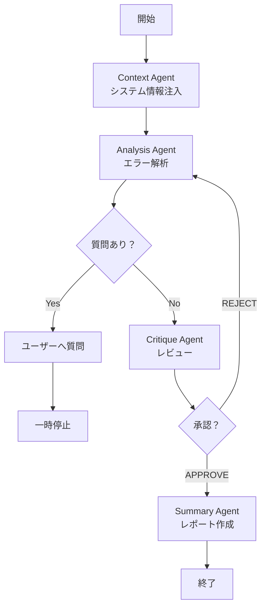

# AI Agent Architecture & Self-Reflective Workflow

本システムでは、LangGraphを用いたマルチエージェント・アーキテクチャを採用しています。
各エージェントは専門的な役割を持ち、互いに連携・批評し合うことで、高精度なログ分析を実現します。

## 1. エージェント構成 (Agents)

### 1. Context Agent (システム情報管理者)
- **役割**: 分析の前提となるシステム情報（アーキテクチャ、ログ形式、正常系の定義など）をコンテキストとして提供します。
- **目的**: 全てのエージェントが共通の理解に基づいて分析を行えるようにします。

### 2. Analysis Agent (エラー解析担当)
- **役割**: ログファイルを詳細に分析し、エラーの特定、原因究明、解決策の提示を行います。
- **特徴**:
  - 具体的なログ（ファイル名、行番号）を証拠として引用します。
  - **Human-in-the-loop**: 不明点がある場合、勝手に推測せずユーザーに質問を行います（「QUESTION_TO_USER」）。

### 3. Critique Agent (厳格なレビュアー)
- **役割**: Analysis Agentの分析結果を検証します。
- **チェック項目**:
  - 証拠の引用は十分か？（ログの行番号など）
  - 論理的な飛躍はないか？
- **動作**: 
  - 分析が不十分な場合、「REJECT」判定を出し、修正指示と共にAnalysis Agentに差し戻します。
  - **制限**: 無限ループを防ぐため、指摘は**最大1回**に制限されています。2回目は自動的に承認されます。

### 4. Summary Agent (レポート作成担当)
- **役割**: 最終的な分析結果を、専門的かつ分かりやすいレポートにまとめます。
- **出力**: 管理者や開発チームに提出可能な形式（エグゼクティブサマリー、詳細分析、推奨アクション）で出力します。

---

## 2. 自律的な議論・修正ループ (Self-Reflective Workflow)

本システムの特徴は、単にLLMが一度出力して終わりではなく、**「分析 → 批評 → 修正」**という反復プロセスを持っている点です。

### ワークフロー図

### 処理の流れ
1. **初期分析**: Analysis Agentがログを分析し、ドラフトを作成します。
2. **レビュー**: Critique Agentがドラフトを厳しくチェックします。「証拠がない」「論理がおかしい」などの不備があれば、具体的な改善指示を出します。
3. **自己修正 (Self-Correction)**: Analysis Agentは指摘を受け取り、再度ログを見直して分析を修正します。
4. **最終化**: Critique Agentが承認（または指摘回数上限に到達）すると、Summary Agentが最終レポートを作成します。

## 3. ユーザー参加型プロセス (User-in-the-loop)

- **質問機能**: エージェントが判断に迷った場合（例：未知のエラーコード、仕様の確認）、ユーザーに質問を投げかけます。
- **追加指示**: ユーザーはレポート生成後も、チャット形式で追加の質問や補足情報の提供が可能です。エージェントは過去の経緯を記憶したまま、再分析を行います。
